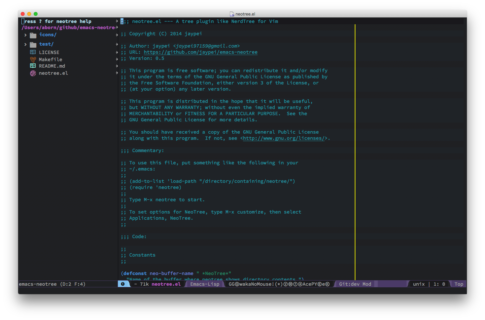

# emacs-neotree

A Emacs tree plugin forked from [jaypei](https://github.com/jaypei/emacs-neotree)

## Keybindings

Only in Neotree Buffer:

* `n` next line, `p` previous line。
* `SPC` or `RET` or `TAB` Open current item if it is a file. Fold/Unfold current item if it is a directory.
* `U` Go up a directory
* `g` Refresh
* `A` Maximize/Minimize the NeoTree Window
* `H` Toggle display hidden files
* `O` Recursively open a directory
* `C-c C-n` Create a file or create a directory if filename ends with a ‘/’
* `C-c C-d` Delete a file or a directory.
* `C-c C-r` Rename a file or a directory.
* `C-c C-c` Change the root directory.
* `C-c C-p` Copy a file or a directory.


## Configurations

### Theme config
NeoTree provides following themes: 
- *classic* (default)
- *ascii*
- *arrow*
- *icons*[^1]
- *nerd-icons*[^2]
- *nerd*

Theme can be configed by setting **neo-theme**. For example, use *icons* for window 
system and *arrow* terminal.

```elisp
(setq neo-theme (if (display-graphic-p) 'icons 'arrow))
```

* all-the-icons theme screenshots  


## More documentation

[^1]: For users who want to use the `icons` theme. Please make sure you have installed the
[all-the-icons](https://github.com/domtronn/all-the-icons.el) package and its
[fonts](https://github.com/domtronn/all-the-icons.el/tree/master/fonts).

[^2]: For users who want to use the `nerd-icons` theme. Please make sure you have installed the
[nerd-icons](https://github.com/rainstormstudio/nerd-icons.el?tab=readme-ov-file) package and
one of its [fonts](https://www.nerdfonts.com/).
