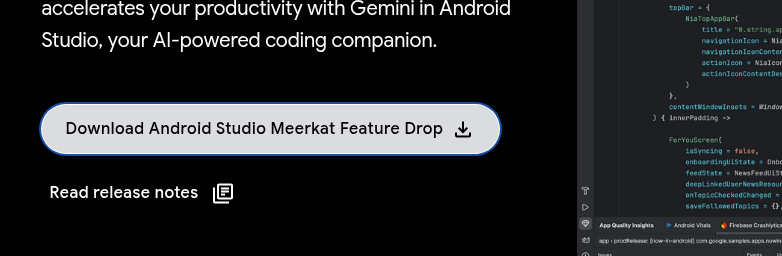

# Installing apps on Debian Docs

### Installing Visual Studio Code

Run:
```
sudo apt update
sudo apt install -y software-properties-common apt-transport-https wget
wget -q https://packages.microsoft.com/keys/microsoft.asc -O- | sudo apt-key add -
sudo add-apt-repository "deb [arch=amd64] https://packages.microsoft.com/repos/code stable main"
sudo apt update
sudo apt install -y code
```

#### Create Desktop Shortcut

To create a Desktop shortcut to Visual Studio Code, run:
```
cp /usr/share/applications/code.desktop ~/Desktop/
chmod +x ~/Desktop/code.desktop
```

### Installing Kdenlive Video Editor

Run:
```
sudo apt update
sudo apt install kdenlive
```

#### Create Desktop Shortcut

To create a Desktop shortcut to Kdenlive, run:
```
cp /usr/share/applications/org.kde.kdenlive.desktop ~/Desktop/
chmod +x ~/Desktop/org.kde.kdenlive.desktop
```

### Installing FileZilla

Run:
```
sudo apt update
sudo apt install filezilla
```

To create a Desktop shortcut to FileZilla, run:
```
cp /usr/share/applications/filezilla.desktop ~/Desktop/
chmod +x ~/Desktop/filezilla.desktop
```

### Installing Google Chrome

Run:
```
wget https://dl.google.com/linux/direct/google-chrome-stable_current_amd64.deb
sudo apt install ./google-chrome-stable_current_amd64.deb
```

To create a Desktop shortcut to Google Chrome, run:
```
cp /usr/share/applications/google-chrome.desktop ~/Desktop/
```

### Installing Mousepad text editor

Run:
```
sudo apt update
sudo apt install mousepad
```

To create a Desktop shortcut to Mousepad, run:
```
cp /usr/share/applications/org.xfce.mousepad.desktop ~/Desktop/
```

### Installing Node, nvm, npm, npx and yarn

Run:
```
sudo apt update
sudo apt install curl build-essential -y
curl -o- https://raw.githubusercontent.com/nvm-sh/nvm/v0.39.5/install.sh | bash
export NVM_DIR="$HOME/.nvm"
[ -s "$NVM_DIR/nvm.sh" ] && \. "$NVM_DIR/nvm.sh"
nvm install --lts
npm install -g yarn
```

To verify installation, run:
```
node -v
nvm -v
npm -v
npx -v
yarn -v
```

### Installing Microsoft Edge

Run:
```
curl -fsSL https://packages.microsoft.com/keys/microsoft.asc | gpg --dearmor | sudo tee /usr/share/keyrings/microsoft.gpg > /dev/null
echo "deb [arch=amd64 signed-by=/usr/share/keyrings/microsoft.gpg] https://packages.microsoft.com/repos/edge stable main" | sudo tee /etc/apt/sources.list.d/microsoft-edge.list
sudo apt update
sudo apt install microsoft-edge-stable
```

To create a Desktop shortcut to Mousepad, run:
```
cp /usr/share/applications/com.microsoft.Edge.desktop ~/Desktop/
```

### Installing Zoom

Run:
```
wget https://zoom.us/client/latest/zoom_amd64.deb
sudo apt update
sudo apt install -y gdebi-core
sudo gdebi zoom_amd64.deb
```

To create a Desktop shortcut to Mousepad, run:
```
cp /usr/share/applications/Zoom.desktop ~/Desktop/
```

### Installing VirtualBox

Run:
```
sudo apt update
sudo apt install -y wget gnupg2 lsb-release
wget -q https://www.virtualbox.org/download/oracle_vbox_2016.asc -O- | sudo gpg --dearmor -o /usr/share/keyrings/oracle-virtualbox-archive-keyring.gpg
echo "deb [signed-by=/usr/share/keyrings/oracle-virtualbox-archive-keyring.gpg] https://download.virtualbox.org/virtualbox/debian $(lsb_release -cs) contrib" | sudo tee /etc/apt/sources.list.d/virtualbox.list
sudo apt update
sudo apt install -y virtualbox-7.0
sudo usermod -aG vboxusers $USER
```

Replace `virtualbox-7.0` with the version of VirtualBox you want to install

To verify installation, run:
```
vboxmanage --version
```

To create a Desktop shortcut to VirtualBox, run:
```
cp /usr/share/applications/virtualbox.desktop ~/Desktop/
```

### Installing HandBrake

Run:
```
sudo apt update
sudo apt install handbrake handbrake-cli
```

To create a Desktop shortcut to HandBrake, run:
```
cp /usr/share/applications/fr.handbrake.ghb.desktop ~/Desktop/
```

### Installing GitHub Desktop

Go to the [GitHub Desktop Releases](https://github.com/shiftkey/desktop/releases)

Open the Assets expandable section

Copy the link of the correct `.deb` installation media for your computer

Run:
```
sudo apt update
wget LINK-YOU-COPIED
ls
sudo dpkg -i <filename>.deb
rm FILE-NAME-OF-DEB-PACKAGE
```

To create a Desktop shortcut to GitHub Desktop, run:
```
cp /usr/share/applications/github-desktop.desktop ~/Desktop/
```

To display GitHub Desktop in Gnome Software, run:
```
sudo nano /usr/share/metainfo/github-desktop.metainfo.xml

Paste this text in the file:
```
<?xml version="1.0" encoding="UTF-8"?>
<component type="desktop-application">
  <id>github-desktop.desktop</id>
  <name>GitHub Desktop</name>
  <summary>Simple collaboration from your desktop</summary>
  <description>
    <p>GitHub Desktop is a graphical Git client that allows you to interact with GitHub using a clean and simple interface.</p>
  </description>
  <launchable type="desktop-id">github-desktop.desktop</launchable>
  <url type="homepage">https://desktop.github.com/</url>
  <developer_name>GitHub, Inc.</developer_name>
  <metadata_license>CC0-1.0</metadata_license>
  <project_license>MIT</project_license>
</component>
```

Run:
```
sudo appstreamcli refresh --force
```

Close Gnome Software

Log out

Log in

GitHub Desktop should now appear in Gnome Software

### Install Brave Web Browser

Run:
```
sudo apt install curl apt-transport-https
sudo curl -fsSLo /usr/share/keyrings/brave-browser-archive-keyring.gpg https://brave-browser-apt-release.s3.brave.com/brave-browser-archive-keyring.gpg
echo "deb [signed-by=/usr/share/keyrings/brave-browser-archive-keyring.gpg] https://brave-browser-apt-release.s3.brave.com/ stable main" | sudo tee /etc/apt/sources.list.d/brave-browser-release.list
sudo apt update
sudo apt install brave-browser
```

Go to the [Raindrop.io extension](https://chromewebstore.google.com/detail/raindropio/ldgfbffkinooeloadekpmfoklnobpien) page

Click `Add to Brave`

Login to the extension

### Install Android Studio

Go to the official [Android Studio website](https://developer.android.com/studio)

Download the latest version of Android Studio by clicking the following Download button:



Extract the downloaded folder by running:
```
tar -xzf android-studio-*.tar.gz
```

Move the extracted directory to the `/opt` directory by running:
```
sudo mv android-studio /opt/
```

To create a Desktop shortcut to Android Studio, run:
```
cd ~/Desktop/
touch android-studio.desktop
nano android-studio.desktop
```

Paste the following code in the file:
```
[Desktop Entry]
Version=1.0
Type=Application
Name=Android Studio
Icon=/opt/android-studio/bin/studio.png
Exec="/opt/android-studio/bin/studio.sh" %f
Comment=Android Studio IDE
Categories=Development;IDE;
Terminal=false
```

Run:
```
chmod +x ~/Desktop/android-studio.desktop
```

To create an All Apps shortcut to Android Studio, run:
```
sudo cp ~/Desktop/android-studio.desktop /usr/share/applications/
```

### Install Docker and Docker Desktop

Run:
```
sudo apt update
sudo apt install apt-transport-https ca-certificates curl gnupg software-properties-common lsb-release
curl -fsSL https://download.docker.com/linux/debian/gpg | sudo gpg --dearmor -o /usr/share/keyrings/docker-archive-keyring.gpg
echo "deb [arch=$(dpkg --print-architecture) signed-by=/usr/share/keyrings/docker-archive-keyring.gpg] https://download.docker.com/linux/debian $(lsb_release -cs) stable" | sudo tee /etc/apt/sources.list.d/docker.list >/dev/null
sudo apt update
sudo apt install docker-ce docker-ce-cli containerd.io docker-compose-plugin
wget https://desktop.docker.com/linux/main/amd64/docker-desktop-amd64.deb
sudo apt install ./docker-desktop-amd64.deb
```

To create a Desktop shortcut to Docker Desktop, run:
```
cp /usr/share/applications/docker-desktop.desktop ~/Desktop/
```

### Install Flameshot

Run:
```
sudo apt install
sudo apt install flameshot
```

To run Flameshot, press the Print Screen key on your keyboard

Flameshot does not have a GUI window. To remove the Flameshot application from the All Apps menu, run:
```
mkdir -p ~/.local/share/applications
cp /usr/share/applications/org.flameshot.Flameshot.desktop ~/.local/share/applications/
nano ~/.local/share/applications/org.flameshot.Flameshot.desktop 
```

Add or modify this line:
```
NoDisplay=true
```

Log out and  back in to apply the changes

### Install Tesseract OCR Text Extractor

Run:
```
sudo apt update
sudo apt install flameshot tesseract-ocr xclip
mkdir ~/bin/
touch ~/bin/text-extractor.sh
nano ~/bin/text-extractor.sh
```

Paste the following code into the file:
```
#!/bin/bash

# Temp file for screenshot
TEMP_SCREENSHOT="/tmp/ocr-screenshot.png"

# Capture screenshot using Flameshot (GUI mode, save to temp file)
flameshot gui -r > "$TEMP_SCREENSHOT" 2>/dev/null

# Check if the screenshot was taken (file exists and is not empty)
if [ -f "$TEMP_SCREENSHOT" ] && [ -s "$TEMP_SCREENSHOT" ]; then
    # Run OCR and copy to clipboard
    tesseract "$TEMP_SCREENSHOT" - | xclip -selection clipboard
    # Send a notification
    notify-send "OCR Screenshot" "Text extracted and copied to clipboard!"
else
    notify-send "OCR Screenshot" "Screenshot canceled or failed."
fi
```

Run:
```
chmod +x ~/bin/text-extractor.sh
```

Open the Settings app

Go to the Keyboard section

Select `View and Customize Shortcuts` under `Keyboard Shortcuts`

Select Custom Shortcuts

Create a new Shortcut

Set the Name as `Text Extractor`

Set the Command as the absolute path to the `text-extractor.sh` script. e.g. `/home/user/bin/text-extractor.sh`

Set the Shortcut as `CTRL + Shift + S`

Save the Shortcut

Test the command by clicking `CTRL + Shift + S`

Take a screenshot of a screen containing text

Check if the text was saved to the clipboard

### Install VLC Media Player

Run:
```
sudo apt update
sudo apt install vlc
```

To create a Desktop shortcut to VLC Media Player, run:
```
cp /usr/share/applications/vlc.desktop ~/Desktop/
```

### Install Viewnior Image Viewer

Run:
```
sudo apt update
sudo apt install viewnior
`````

To create a Desktop shortcut to Viewnior, run:
```
cp /usr/share/applications/viewnior.desktop ~/Desktop/
```

### Install Gimp Image Editor

Run:
```
sudo apt update
sudo apt install gimp
```

To create a Desktop shortcut to Gimp, run:
```
cp /usr/share/applications/gimp.desktop ~/Desktop/
```

### Install Shutter Screen Ruler

Run:
```
sudo apt update
sudo apt-get install shutter
```

To create a Desktop shortcut to Shutter, run:
```
cp /usr/share/applications/shutter.desktop ~/Desktop/
```

To use the screen ruler, open shutter and select `Selection`

### Install Krename File Renamer

Run:
```
sudo apt update
sudo apt install krename
```

### Install Qdirstat Disk Space Analyzer

Run:
```
sudo apt update
sudo apt install qdirstat
```