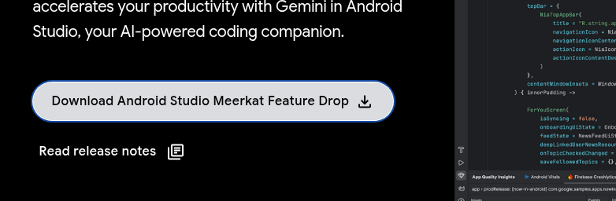

# Installing apps on Debian Docs

### Installing Emacs

Run:
```
sudo apt update
sudo apt install fonts-firacode
sudo apt-get install emacs-gtk
```

### Installing GitKraken

Run:
```
wget https://release.gitkraken.com/linux/gitkraken-amd64.deb
sudo dpkg -i gitkraken-amd64.deb
```

### Installing Visual Studio Code

Run:
```
sudo apt update
sudo apt install -y software-properties-common apt-transport-https wget
wget -q https://packages.microsoft.com/keys/microsoft.asc -O- | sudo apt-key add -
sudo add-apt-repository "deb [arch=amd64] https://packages.microsoft.com/repos/code stable main"
sudo apt update
sudo apt install -y code
```

### Installing Kdenlive Video Editor

Run:
```
sudo apt update
sudo apt install kdenlive
```

### Installing FileZilla

Run:
```
sudo apt update
sudo apt install filezilla
```

### Installing Google Chrome

Run:
```
wget https://dl.google.com/linux/direct/google-chrome-stable_current_amd64.deb
sudo apt install ./google-chrome-stable_current_amd64.deb
```

### Installing Mousepad text editor

Run:
```
sudo apt update
sudo apt install mousepad
```

### Installing NVM

Run:
```
sudo apt update
sudo apt install curl build-essential -y
curl -o- https://raw.githubusercontent.com/nvm-sh/nvm/v0.39.5/install.sh | bash
export NVM_DIR="$HOME/.nvm"
[ -s "$NVM_DIR/nvm.sh" ] && \. "$NVM_DIR/nvm.sh"
nvm install --lts
npm install -g yarn
```

> Replace `v0.39.5` with the latest stable version of NVM

To verify installation, run:
```
node -v
nvm -v
npm -v
npx -v
yarn -v
```

### Installing Microsoft Edge

Run:
```
curl -fsSL https://packages.microsoft.com/keys/microsoft.asc | gpg --dearmor | sudo tee /usr/share/keyrings/microsoft.gpg > /dev/null
echo "deb [arch=amd64 signed-by=/usr/share/keyrings/microsoft.gpg] https://packages.microsoft.com/repos/edge stable main" | sudo tee /etc/apt/sources.list.d/microsoft-edge.list
sudo apt update
sudo apt install microsoft-edge-stable
```

### Installing Zoom

Run:
```
wget https://zoom.us/client/latest/zoom_amd64.deb
sudo apt update
sudo apt install -y gdebi-core
sudo gdebi zoom_amd64.deb
```

### Installing VirtualBox

Run:
```
sudo apt update
sudo apt install -y wget gnupg2 lsb-release
wget -q https://www.virtualbox.org/download/oracle_vbox_2016.asc -O- | sudo gpg --dearmor -o /usr/share/keyrings/oracle-virtualbox-archive-keyring.gpg
echo "deb [signed-by=/usr/share/keyrings/oracle-virtualbox-archive-keyring.gpg] https://download.virtualbox.org/virtualbox/debian $(lsb_release -cs) contrib" | sudo tee /etc/apt/sources.list.d/virtualbox.list
sudo apt update
sudo apt install -y virtualbox-7.0
sudo usermod -aG vboxusers $USER
```

Replace `virtualbox-7.0` with the version of VirtualBox you want to install

To verify installation, run:
```
vboxmanage --version
```

### Installing HandBrake

Run:
```
sudo apt update
sudo apt install handbrake handbrake-cli
```

### Installing GitHub Desktop

Go to the [GitHub Desktop Releases](https://github.com/shiftkey/desktop/releases)

Open the Assets expandable section

Copy the link of the correct `.deb` installation media for your computer

Run:
```
sudo apt update
wget LINK-YOU-COPIED
ls
sudo dpkg -i <filename>.deb
rm FILE-NAME-OF-DEB-PACKAGE
```

### Install Brave Web Browser

Run:
```
sudo apt install curl apt-transport-https
sudo curl -fsSLo /usr/share/keyrings/brave-browser-archive-keyring.gpg https://brave-browser-apt-release.s3.brave.com/brave-browser-archive-keyring.gpg
echo "deb [signed-by=/usr/share/keyrings/brave-browser-archive-keyring.gpg] https://brave-browser-apt-release.s3.brave.com/ stable main" | sudo tee /etc/apt/sources.list.d/brave-browser-release.list
sudo apt update
sudo apt install brave-browser
```

### Install Android Studio

Go to the official [Android Studio website](https://developer.android.com/studio)

Download the latest version of Android Studio by clicking the following Download button:



Extract the downloaded folder by running:
```
tar -xzf android-studio-*.tar.gz
```

Move the extracted directory to the `/opt` directory by running:
```
sudo mv android-studio /opt/
```

### Install Docker and Docker Desktop

Run:
```
sudo apt update
sudo apt install apt-transport-https ca-certificates curl gnupg software-properties-common lsb-release
curl -fsSL https://download.docker.com/linux/debian/gpg | sudo gpg --dearmor -o /usr/share/keyrings/docker-archive-keyring.gpg
echo "deb [arch=$(dpkg --print-architecture) signed-by=/usr/share/keyrings/docker-archive-keyring.gpg] https://download.docker.com/linux/debian $(lsb_release -cs) stable" | sudo tee /etc/apt/sources.list.d/docker.list >/dev/null
sudo apt update
sudo apt install docker-ce docker-ce-cli containerd.io docker-compose-plugin
wget https://desktop.docker.com/linux/main/amd64/docker-desktop-amd64.deb
sudo apt install ./docker-desktop-amd64.deb
```

### Install KDE Spectacle

Run:
```
sudo apt update
sudo apt install kde-spectacle
```

### Install CopyQ Clipboard Manager

Run:
```
sudo apt update
sudo apt install copyq
```

### Install Tesseract OCR Text Extractor

Run:
```
sudo apt update
sudo apt install tesseract-ocr xclip
mkdir ~/bin/
touch ~/bin/text-extractor.sh
nano ~/bin/text-extractor.sh
```

Paste the code found in `bin/text-extractor.sh` in this repository

Run:
```
chmod +x ~/bin/text-extractor.sh
```

Open the System Settings app

Select `Shortcuts`

Click `Add Command`

In the command field, type `/home/abdul/bin/text-extractor.sh`

Click `Add custom shortcut`

Press `Ctrl + Shift + S`

Test the command by clicking `CTRL + Shift + S`

Take a screenshot of a screen containing text

Check if the text was saved to the clipboard

### Install VLC Media Player

Run:
```
sudo apt update
sudo apt install vlc
```

### Install Viewnior Image Viewer

Run:
```
sudo apt update
sudo apt install viewnior
`````

### Install Gimp Image Editor

Run:
```
sudo apt update
sudo apt install gimp
```

### Install Shutter Screen Ruler

Run:
```
sudo apt update
sudo apt-get install shutter
```

### Install Krename File Renamer

Run:
```
sudo apt update
sudo apt install krename
```

### Install Qdirstat Disk Space Analyzer

Run:
```
sudo apt update
sudo apt install qdirstat
```

### Install ThunderBird Email Client

Run:
```
sudo apt update
sudo apt install thunderbird
```

### Install Hardinfo System Profiler

Run:
```
sudo apt update
sudo apt install hardinfo
```

### Install Stacer

Run:
```
sudo apt update
sudo apt install stacer
```

### Install Hstr

Hstr allows you to view, use and edit all of the bash history from the terminal

Run:
```
sudo apt install hstr
```

Ensure these line is added to the `.bashrc` file:
```
export HSTR_CONFIG=hicolor
bind '"\C-r": "\C-a hstr -- \C-j"'  # Better Ctrl+R history menu
```

Restart the terminal

Now, when pressing `Ctrl+R`, a list of previous commands will be displayed

### Install Clamav Malware Scanner

Run:
```
sudo apt update
sudo apt install clamav clamtk clamav-daemon
```
