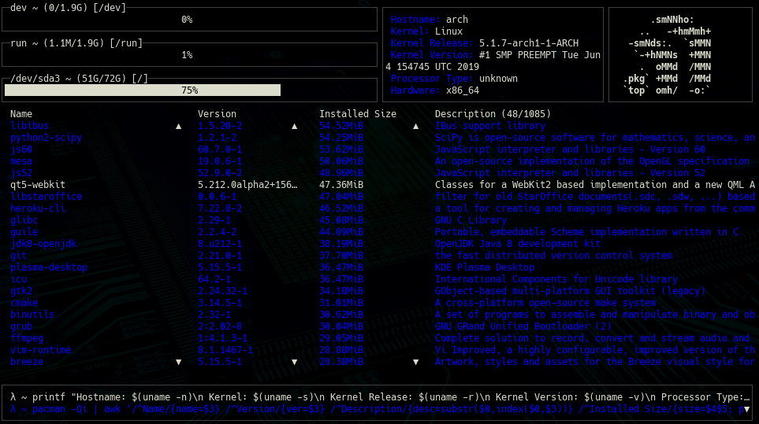
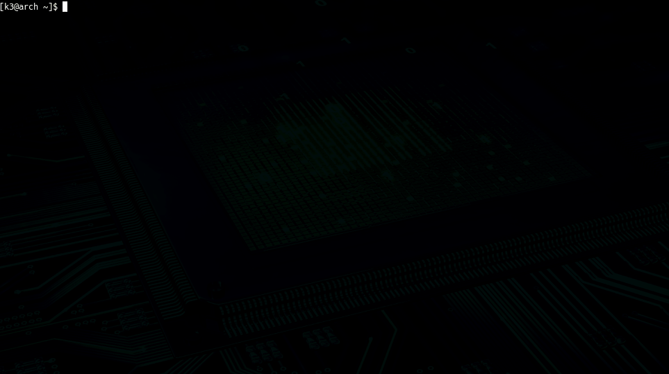
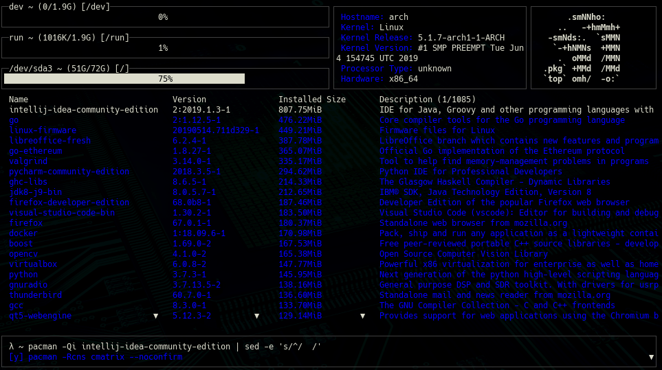
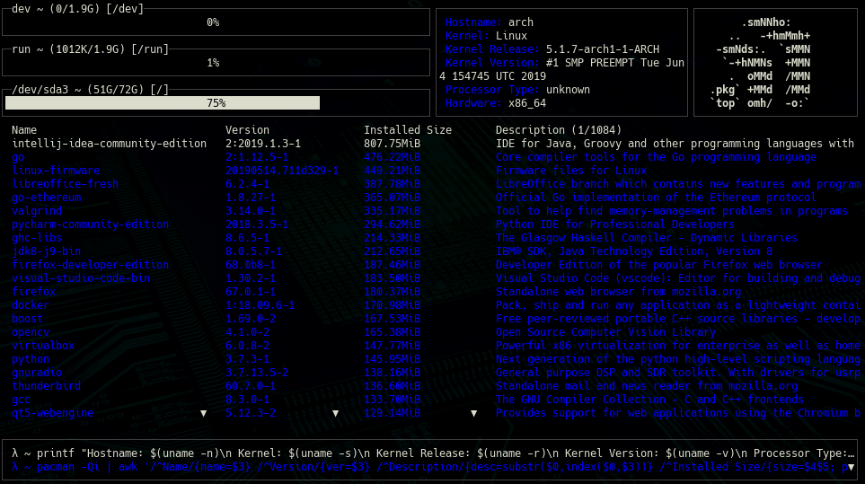

**pkgtop** is an **interactive package manager** & **resource monitor** tool designed for the GNU/Linux.



Using pkgtop, it's possible to list installed packages by size (or alphabetically with `-a` argument), show information about the package, install/upgrade/remove packages and search package

In addition to the package management features, there's a section at the top of the dashboard that shows disk usages and general system information. For example, this section can be used as a resource monitor and help decide whether the system should be cleaned or not.

Another useful section is the '`executed`' or '`confirm to execute`' command list which is placed below the installed packages. Thus, the user can see which command executed recently or confirm & execute the selected command. (The commands that need confirmation to execute exist in the list with a prefix like "`[y]`".) 

After scrolling the commands list with "`c`" key for selecting the command to execute, press "`y`" for executing it. pkgtop will execute the command and restart the terminal dashboard afterwards.

- [Command-Line Arguments](#command-line-arguments)
- [Usage](#usage)
  - [List Installed Packages & Show Package Information](#list-installed-packages--show-package-information)
  - [Search, Go-to Package](#search-go-to-package)
  - [Install, Upgrade, Remove Package](#install-upgrade-remove-package)
  - [Show Disk Usage Information](#show-disk-usage-information)
  - [Confirm Command to Execute](#confirm-command-to-execute)
  - [Show Help](#show-help)

## Command-Line Arguments
```
-h, show help message
-d, select linux distribution
-c, main color of the dashboard (default: blue)
   [red, green, yellow, blue, magenta, cyan, white]
-a, sort packages alphabetically
-r, reverse the package list
-v, print version
```

## Usage

| Key                      	| Action                                   	|
|--------------------------	|------------------------------------------	|
| `?`                      	| help                                     	|
| `enter, space, tab`      	| show package information                 	|
| `i`                      	| install package                          	|
| `u/ctrl-u`               	| upgrade package/with input               	|
| `r/ctrl-r`               	| remove package/with input                	|
| `s,/`                      	| search package                           	|
| `g`                      	| go to package (index)                    	|
| `y`                      	| confirm and execute the selected command 	|
| `p`                      	| copy selected package                    	|
| `e`                      	| copy selected command                    	|
| `c`                      	| scroll executed commands list            	|
| `j/k, down/up`           	| scroll down/up (packages)                	|
| `ctrl-j/ctrl-k`          	| scroll to bottom/top (packages)          	|
| `l/h, right/left`        	| scroll down/up (disk usage)              	|
| `backspace`              	| go back                                  	|
| `q, esc, ctrl-c, ctrl-d` 	| exit                                     	|

### List Installed Packages & Show Package Information



```
pressed keys: down, enter, backspace
```

### Search, Go-to Package


```
pressed keys: s, (type), enter, g, (type), enter
```

### Install, Upgrade, Remove Package


```
pressed keys:
i, (type), enter, y -> install
ctrl-u, (type), enter, y -> upgrade
ctrl-r, (type), enter, y -> remove
```

### Show Disk Usage Information


```
pressed keys: right, left
```

### Confirm Command to Execute


```
pressed keys: c, y
```

### Show Help



```
pressed key: ?
```