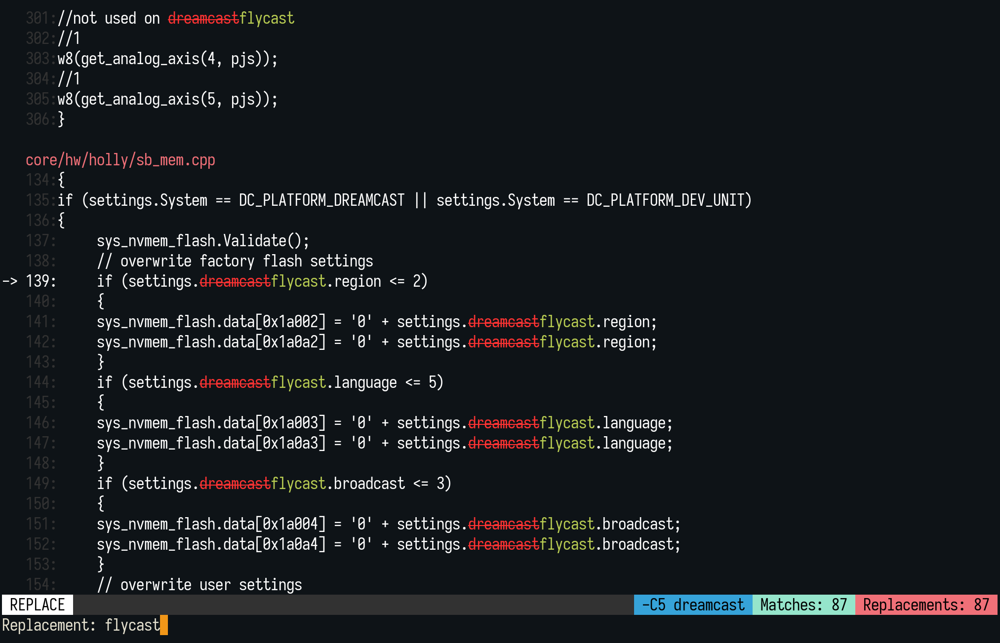

# repgrep (rgr)

_An interactive replacer for `ripgrep`._

This is an interactive command line tool to make find and replacement easy.
It uses [`ripgrep`] to find, and then provides you with a simple interface to see
the replacements in real-time and conditionally replace matches.

Some features:

* ⚡ Super fast search results
* ✨ Interactive interface for selecting which matches should be replaced or not
* 🕶️ Live preview of the replacements
* 🧠 Replace using capturing groups (e.g., when using `/foo (\w+)/` replace with `bar $1`)
* 🦀 and more!

Supported file encodings:

* ASCII
* UTF8
* UTF16BE
* UTF16LE

Other encodings are possibly supported but untested at the moment.
See [this issue](https://github.com/acheronfail/repgrep/issues/12) for more information.

## Usage

After installing, just use `rgr` (think: `rg` + `replace`).

The arguments are:

```bash
rgr <rg arguments> # See `rgr --help` for more details
```

Here's an example where we ran the command:

```bash
rgr -C5 dreamcast
```

And have entered the replacement `flycast`:



License: Unlicense OR MIT OR Apache-2.0