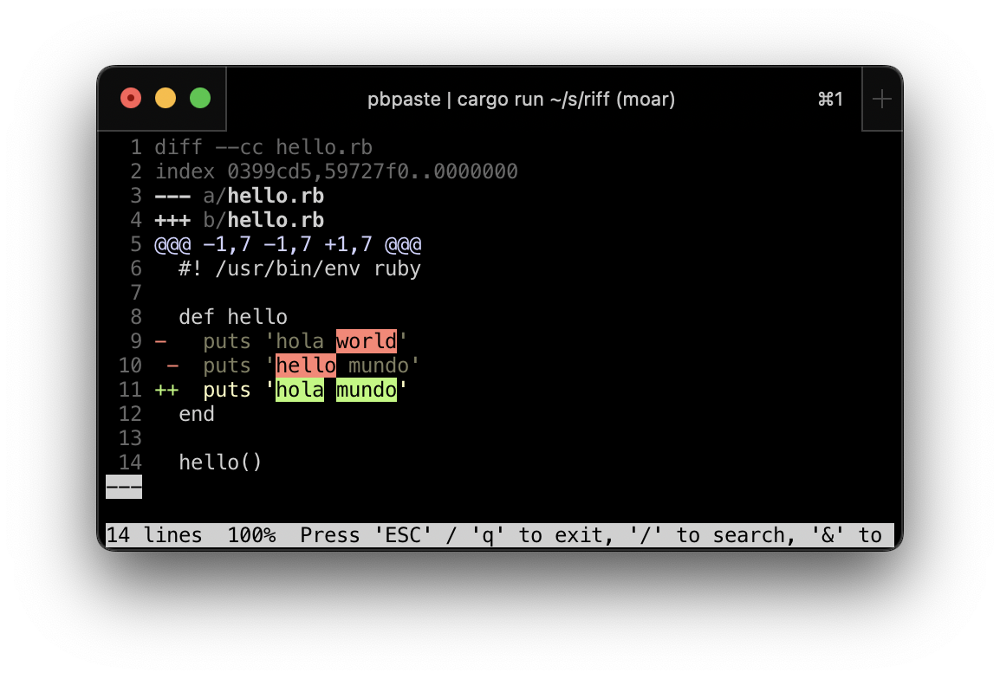

# Riff, the Refining Diff

Riff is a wrapper around `diff` that highlights which parts of lines have changed.

Unchanged parts of changed lines are shown in yellow. File names and hunk headers are hyperlinked to the relevant source code lines where possible.

`riff` also [highlights conflicts and merge commits](#more-features).

Much like `git`, Riff sends its output to a pager, trying these in order:

1. Whatever is specified in the `$PAGER` environment variable
1. [moor](https://github.com/walles/moor) because it is nice
1. `less` because it is ubiquitous

## Configuration

You can configure `riff` by setting the `RIFF` environment variable to one or more (space separated) command line options.

For example, set `RIFF=--unchanged-style=yellow` to get nicer visualization of unchanged line parts.

# More Features

`riff` can highlight conflict markers created by `git`:

`riff` highlighting a `git` merge commits highlighting

